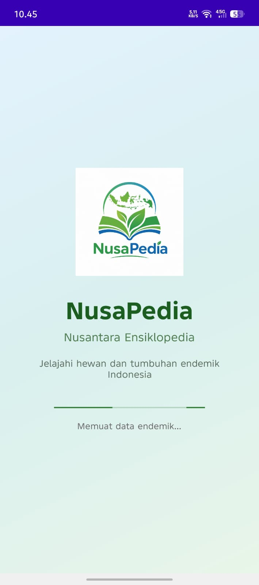
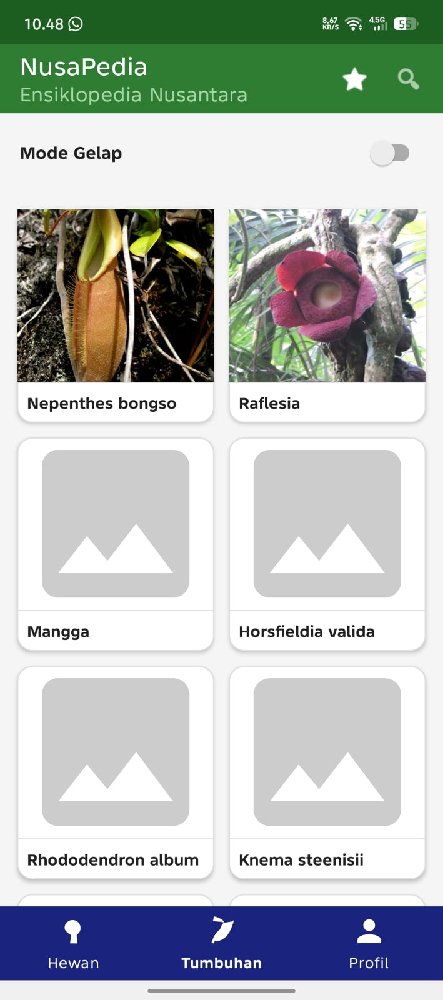
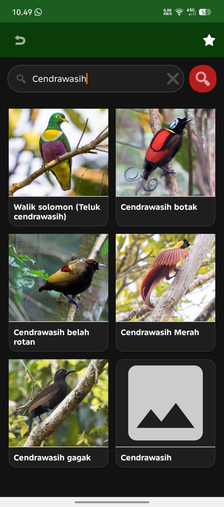
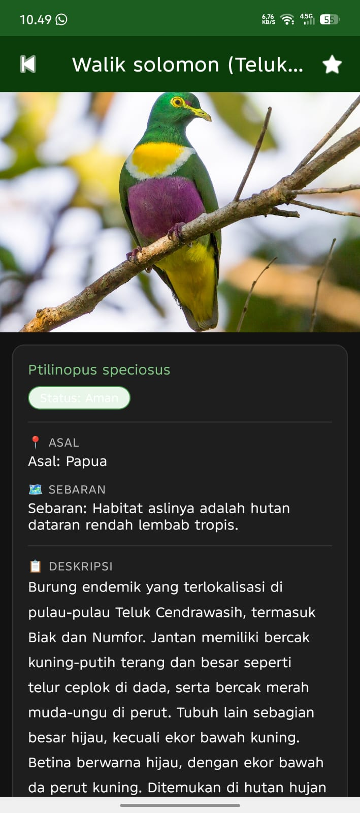
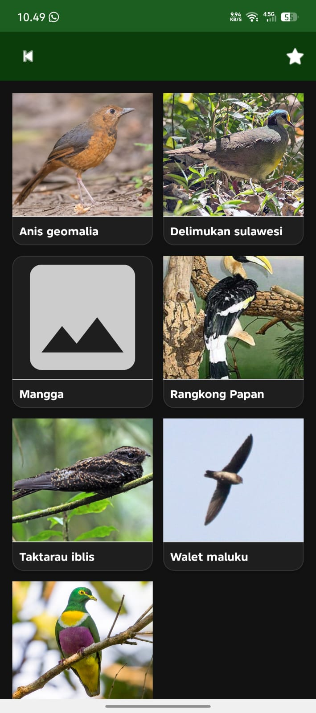

**NusaPedia**
NusaPedia adalah aplikasi Android berbasis ensiklopedia digital yang menampilkan informasi hewan dan tumbuhan endemik Indonesia, Aplikasi ini dikembangkan menggunakan Java pada Android Studio dengan arsitektur multi-Activity/Fragment

**Tangkapan Layar**
<table>
  <tr>
    <td align="center"><b>Splash Screen</b></td>
    <td align="center"><b>Home</b></td>
    <td align="center"><b>Tumbuhan</b></td>
  </tr>
  <tr>
    <td></td>
    <td></td>
    <td></td>
  </tr>
  <tr>
    <td align="center"><b>Pencarian</b></td>
    <td align="center"><b>Detail</b></td>
    <td align="center"><b>Favorit</b></td>
  </tr>
  <tr>
    <td></td>
    <td></td>
    <td></td>
  </tr>
  <tr>
    <td align="center"><b>Profil</b></td>
    <td></td>
    <td></td>
  </tr>
  <tr>
    <td colspan="3" align="center"></td>
  </tr>
</table>
