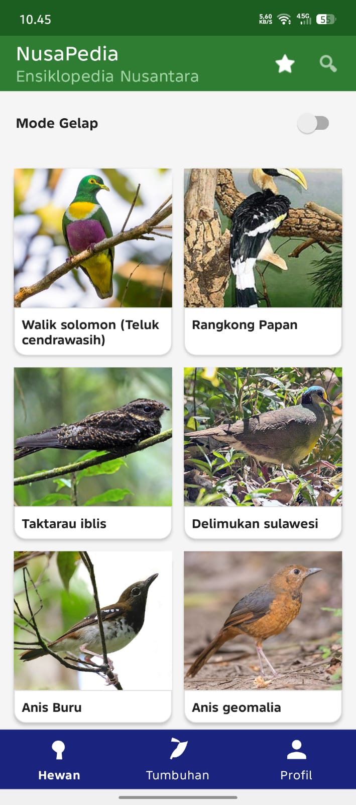

**NusaPedia**
NusaPedia adalah aplikasi Android berbasis ensiklopedia digital yang menampilkan informasi hewan dan tumbuhan endemik Indonesia, Aplikasi ini dikembangkan menggunakan Java pada Android Studio dengan arsitektur multi-Activity/Fragment

**Tangkapan Layar**

Splash Screen

Hewan

Tumbuhan

Pencarian

Detail

Favorit

Profil

